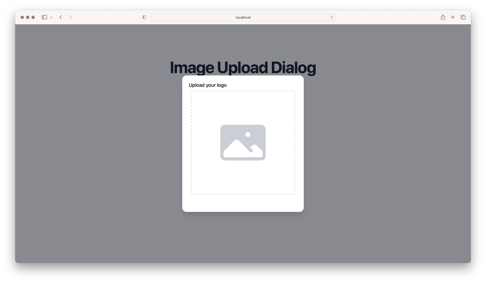

<p align="center">
  
</p>

# Solid Image Crop

Solid.js simple image crop tool using
[Cropper.js](https://github.com/fengyuanchen/cropperjs).

## Installation

    pnpm i @zentered/solid-image-crop
    # or npm install @zentered/solid-image-crop
    # or yarn add @zentered/solid-image-crop

## Usage

```jsx
import { createSignal } from 'solid-js'
import ImageUploadDialog from '@zentered/solid-image-crop'

function App() {
  const [isOpen, setIsOpen] = createSignal(false)

  function closeModal() {
    setIsOpen(false)
  }

  function openModal() {
    setIsOpen(true)
  }

  async function saveImage(file) {
    // Upload the image to your server
    console.log(file)
  }

  return (
    <>
      <button type="button" onClick={openModal}>
        Open Dialog
      </button>
      <ImageUploadDialog
        title="Upload your logo"
        isOpen={isOpen}
        closeModal={closeModal}
        openModal={openModal}
        saveImage={saveImage}
      />
    </>
  )
}

export default App
```

### Special Thanks

- projw-the-lessful, https://codepen.io/projw-the-lessful/pen/bJZKVW
